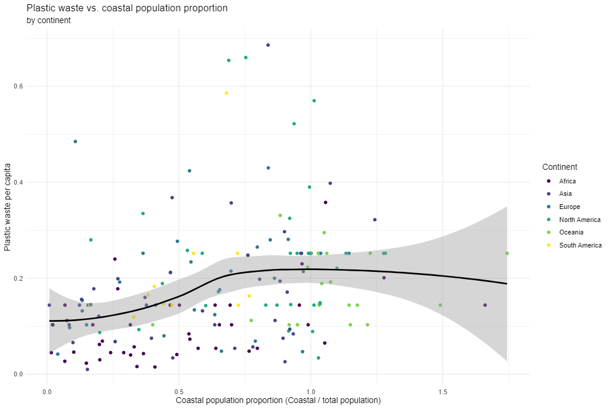

```{r include = FALSE}
knitr::opts_chunk$set(eval = TRUE)
```

Plastic pollution is a major and growing problem, negatively affecting oceans and wildlife health.
[Our World in Data](https://ourworldindata.org/plastic-pollution) has a lot of great data at various levels including globally, per country, and over time.
For this individual homework we focus on data from 2010.

Additionally, National Geographic ran a data visualization communication contest on plastic waste as seen [here](https://www.nationalgeographic.org/funding-opportunities/innovation-challenges/plastic/dataviz/).

# Learning goals

-   Visualizing numerical and categorical data and interpreting visualizations
-   Recreating visualizations
-   Getting more practice using with R, RStudio, Git, and GitHub

# Getting started

Go to the course GitHub organization and locate your assignment repo, which should be named `hw1-plastic-waste-YOUR_GITHUB_USERNAME`.

Grab the URL of the repo, and clone it in RStudio.
Refer to [Happy Git and GitHub for the useR](https://happygitwithr.com/rstudio-git-github.html) if you would like to see step-by-step instructions for cloning a repo into an RStudio project.

First, open the R Markdown document `hw1.Rmd` and Knit it.
Make sure it compiles without errors.
The output will be in HTML `.html` file with the same name.

## Packages

We'll use the **tidyverse** package for this analysis.
Run the following code in the Console to load this package.

```{r load-packages, message=FALSE, eval=TRUE}
library(tidyverse)
```

## Data

The dataset for this assignment can be found as a csv file in the `data` folder of your repository.
You can read it in using the following.

```{r load-data, message=FALSE, eval=TRUE}
plastic_waste <- read_csv("data/plastic-waste.csv")
```

The variable descriptions are as follows:

-   `code`: 3 Letter country code
-   `entity`: Country name
-   `continent`: Continent name
-   `year`: Year
-   `gdp_per_cap`: GDP per capita constant 2011 international \$, rate
-   `plastic_waste_per_cap`: Amount of plastic waste per capita in kg/day
-   `mismanaged_plastic_waste_per_cap`: Amount of mismanaged plastic waste per capita in kg/day
-   `mismanaged_plastic_waste`: Tonnes of mismanaged plastic waste
-   `coastal_pop`: Number of individuals living on/near coast
-   `total_pop`: Total population according to Gapminder

# Warm up

-   Recall that RStudio is divided into four panes. Without looking, can you name them all and briefly describe their purpose?
 
 The four panes are Console,Source Editor,Environment and Files. The purpose of of the source editor is to write our code,the console is used to evaluate the code by R and is also called the command line, the environment pane shows us the objects in our workspace and the class associated with them, the fourth pane has numerous tabs like files,plots , packages and is essentially used to see file directories.


-   Verify that the dataset has loaded into the Environment. How many observations are in the dataset? Clicking on the dataset in the Environment will allow you to inspect it more carefully. Alternatively, you can type `View(plastic_waste)` into the Console to do this.
 
 There are 240 observations of 10 variables in the dataset.

**Hint:** If you're not sure, run the command `?NA` which will lead you to the documentation.

-   Have a quick look at the data and notice that there are cells taking the value `NA` -- what does this mean?

  This means data is not available.

# Exercises

Let's start by taking a look at the distribution of plastic waste per capita in 2010.

```{r plastic_waste_per_cap-hist, eval=TRUE}
ggplot(data = plastic_waste, aes(x = plastic_waste_per_cap)) +
  geom_histogram(binwidth = 0.2)
```

One country stands out as an unusual observation at the top of the distribution.
One way of identifying this country is to filter the data for countries where plastic waste per capita is greater than 3.5 kg/person.

```{r plastic_waste_per_cap-max, eval=TRUE}
plastic_waste %>%
  filter(plastic_waste_per_cap > 3.5)
```

Did you expect this result?
You might consider doing some research on Trinidad and Tobago to see why plastic waste per capita is so high there, or whether this is a data error.

This is not the result we expected. Refering to Plastic waste generation per capita, 2010 for Trinidad and Tobago is 0.29kg : https://ourworldindata.org/plastic-pollution and it's not greater than 3.5 as per the above data.

Q1.  Plot, using histograms, the distribution of plastic waste per capita faceted by continent. What can you say about how the continents compare to each other in terms of their plastic waste per capita?

**NOTE:** From this point onwards the plots and the output of the code are not displayed in the homework instructions, but you can and should the code and view the results yourself.

```{r}
# Your code below:
ggplot(data = plastic_waste, aes(x = plastic_waste_per_cap)) +
  geom_histogram(binwidth = 0.2)+facet_wrap(~continent)
```

The plastic waste per capita of the different continents look more similar than differentiated.

Another way of visualizing numerical data is using density plots.

```{r plastic_waste_per_cap-dens}
ggplot(data = plastic_waste, aes(x = plastic_waste_per_cap)) +
  geom_density()
```

And compare distributions across continents by coloring density curves by continent.

```{r plastic_waste_per_cap-dens-color}
ggplot(
  data = plastic_waste,
  mapping = aes(
    x = plastic_waste_per_cap,
    color = continent
  )
) +
  geom_density()
```

The resulting plot may be a little difficult to read, so let's also fill the curves in with colors as well.

```{r plastic_waste_per_cap-dens-color-fill}
ggplot(
  data = plastic_waste,
  mapping = aes(
    x = plastic_waste_per_cap,
    color = continent,
    fill = continent
  )
) +
  geom_density()
```

The overlapping colors make it difficult to tell what's happening with the distributions in continents plotted first, and hence covered by continents plotted over them.
We can change the transparency level of the fill color to help with this.
The `alpha` argument takes values between 0 and 1: 0 is completely transparent and 1 is completely opaque.
There is no way to tell what value will work best, so you just need to try a few.

```{r plastic_waste_per_cap-dens-color-fill-alpha}
ggplot(
  data = plastic_waste,
  mapping = aes(
    x = plastic_waste_per_cap,
    color = continent,
    fill = continent
  )
) +
  geom_density(alpha = 0.7)
```

This still doesn't look great...

Q2.  Recreate the density plots above using a different (lower) alpha level that works better for displaying the density curves for all continents.

```{r}
# Your code below:
ggplot(
  data = plastic_waste,
  mapping = aes(
    x = plastic_waste_per_cap,
    color = continent,
    fill = continent
  )
) +
  geom_density(alpha = 0.07)
```


Q3.  Describe why we defined the `color` and `fill` of the curves by mapping aesthetics of the plot but we defined the `alpha` level as a characteristic of the plotting geom.

 The color and fill  of the curves resulted in distinguishable density curves for the continents which enhances the presentation.
 The setting of alpha to a lower value reduced the opacity and increased the transparency which made the density curves for all the continents crisp and better respresented.

🧶 ✅ ⬆️ *Now is a good time to knit your document and commit and push your changes to GitHub with an appropriate commit message. Make sure to commit and push all changed files so that your Git pane is cleared up afterwards.*

And yet another way to visualize this relationship is using side-by-side box plots.

```{r plastic_waste_per_cap-box}
ggplot(
  data = plastic_waste,
  mapping = aes(
    x = continent,
    y = plastic_waste_per_cap
  )
) +
  geom_boxplot()
```

Q4.  Convert your side-by-side box plots from the previous task to [violin plots](http://ggplot2.tidyverse.org/reference/geom_violin.html). What do the violin plots reveal that box plots do not? What features are apparent in the box plots but not in the violin plots?

**Remember:** We use `geom_point()` to make scatterplots.

```{r}
# Your code below:
ggplot(
  data = plastic_waste,
  mapping = aes(
    x = continent,
    y = plastic_waste_per_cap
  )
) +
  geom_violin()
```

The violin plots reveal more information about the distribution of data than box plots. The features more apparent in box plots are the summarization of the variation in the dataset and the outliers.


Q5.  Visualize the relationship between plastic waste per capita and mismanaged plastic waste per capita using a scatterplot.
    Describe the relationship.

```{r}
# Your R code below:
ggplot(
  data = plastic_waste,
  mapping = aes(
    x =  mismanaged_plastic_waste_per_cap,
    y = plastic_waste_per_cap)
) +
  geom_point()
```

As we can see from the above visualization that the data points are all concentrated in one area, I think it represents that mismanaged plastic waste per capita is almost the same as the plastic waster per capita.

Q6.  Color the points in the scatterplot by continent.
    Does there seem to be any clear distinctions between continents with respect to how plastic waste per capita and mismanaged plastic waste per capita are associated?

```{r}
# Your R code below:
ggplot(
  data = plastic_waste,
  mapping = aes(
    x =  mismanaged_plastic_waste_per_cap,
    y = plastic_waste_per_cap, color=continent)
) +
  geom_point()
```

In most of the continents, there is a linear trend in the ratio of mismanaged plastic waste per cap/plastic waste per cap, which is about 0.5, or 50% of the total plastic waste per capita. North America is an anomaly since there, the mismanaged plastic waste per cap/plastic waste per cap ratio is around 0.052, or 5.2% of the total plastic waste per capita.


Q7.  Visualize the relationship between plastic waste per capita and total population as well as plastic waste per capita and coastal population.
    You will need to make two separate plots.
    Do either of these pairs of variables appear to be more strongly linearly associated?

```{r}
# Your R code for the first plot below:
ggplot(
  data = plastic_waste,
  mapping = aes(
    x = plastic_waste_per_cap,
    y = total_pop)
) +
  geom_point()
```


```{r}
# Your R code for the second plot below:
ggplot(
  data = plastic_waste,
  mapping = aes(
    x = plastic_waste_per_cap,
    y = coastal_pop)
) +
  geom_point()
```

Neither of these pair appear to be strongly linearly associated.
The distribution of data appears concentration with outliers present in both plots.

🧶 ✅ ⬆️ *Now is another good time to knit your document and commit and push your changes to GitHub with an appropriate commit message. Make sure to commit and push all changed files so that your Git pane is cleared up afterwards.*


Q8.  Recreate the following plot, and interpret what you see in context of the data.

**Hint:** The x-axis is a calculated variable. One country with plastic waste per capita over 3 kg/day has been filtered out. And the data are not only represented with points on the plot but also a smooth curve. The term "smooth" should help you [pick which geom to use](https://ggplot2.tidyverse.org/reference/index.html#section-geoms).




```{r}
# Your code below:

plastic_waste %>%
  filter(entity != "Trinidad and Tobago")
ggplot(data = plastic_waste)+
  ggtitle("Plastic waste vs coastal population proportion \n by continent") +
  xlab("Coastal population proportion(coastal/total population)") + ylab("Plastic waste per capita")+
  
  scale_y_continuous(breaks=seq(0.0, 0.6, 0.1), limits = c(0,0.6))+
  
    
  geom_point(mapping = aes(x = coastal_pop/total_pop,
                           y = plastic_waste_per_cap, color = continent))+
  geom_smooth(mapping = aes(x = coastal_pop/total_pop,
                            y = plastic_waste_per_cap))


```
 The plot above shows positive trend between the coastal population proportion and plastic waste per capita.
 
 
🧶 ✅ ⬆️ Knit, *commit, and push your changes to GitHub with an appropriate commit message. Make sure to commit and push all changed files so that your Git pane is cleared up afterwards and review the md document on GitHub to make sure you're happy with the final state of your work.*

Once you're done, check to make sure your latest changes are on GitHub and that you have a green indicator for the automated check for your R Markdown document knitting.
